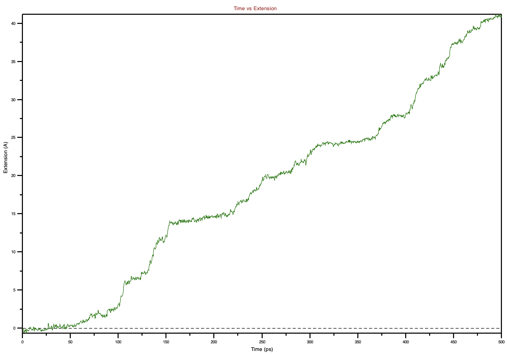
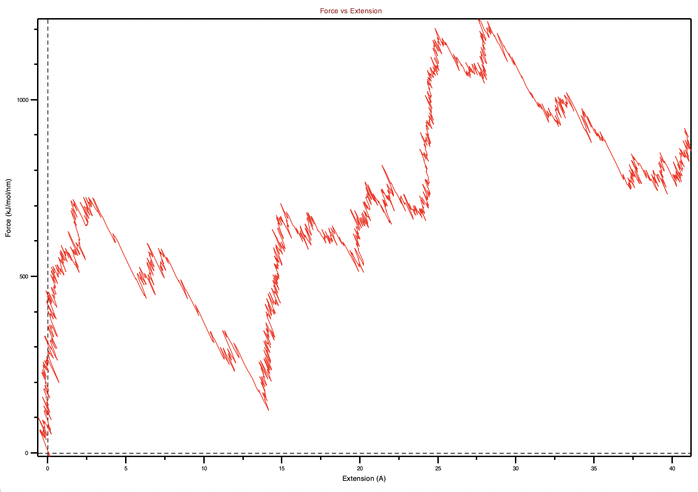
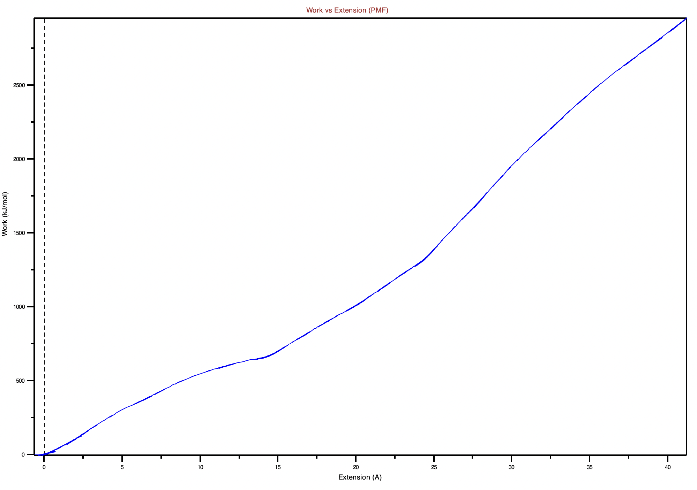
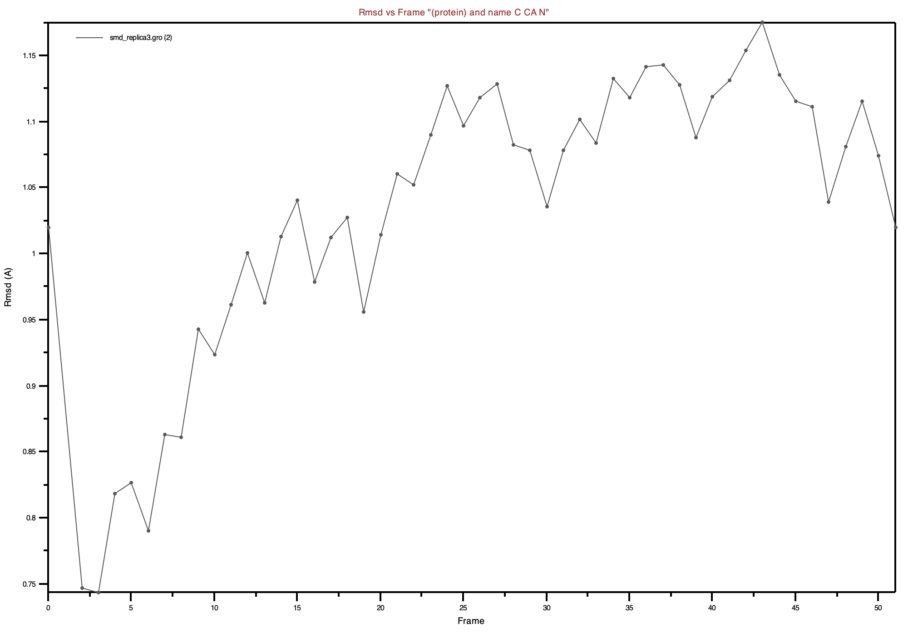
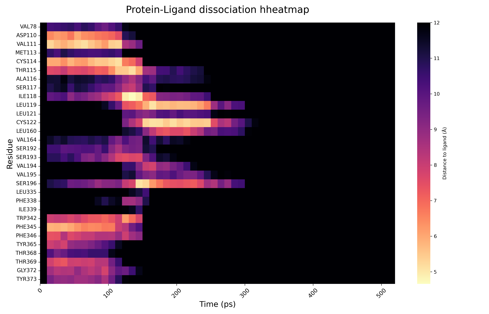

# MSI_project
Drug Discovery – Improvement of Ligand Binding Properties

Link to the drive folder with detailed documentation:
https://drive.google.com/drive/folders/107G5eJHJJhJrEHGiAEx_m73e5bq47zV7?usp=drive_link

## Steered MD

To do this part, it is needed the production ouput files. Also this part was done on an HPC cluster due to high demand on computaitonal power. To otbain them it was run these comands:

```

gmx mdrun -deffnm prod_rep1
gmx mdrun -deffnm prod_rep2
gmx mdrun -deffnm prod_rep3

gmx mdrun -deffnm xxx -nb gpu -pme gpu -bonded gpu -update gpu

```
This is the commands to run the production step, in which the main goal is to simulate the system all along the time period. `mdrun` is used to execute the simulation. `-deffnm` establishes the base name for all the input and output files. So at the end, 3 simulations will be run for the same simulation production. In MD this is done to obtain a better sampling statistics (to take into account all the atomic configurations and energies) and to make sure the results do not depend on the only initial trajectory. 

Also, for this it was necessary to obtain teh file `gromacs/topol.top` and folder `gromacs/toppar/` which are obtained from the CHARMM-GUI output. The file is the main GROMACS topology file. It tells GROMACS what the system is made of, how many molecules there are and which parameters include files to load before building the run input file (`.tpr`) with `gmx grompp`. And the folder contains the actual parameter, usually including the force field definitions, atoms types, bonded parameters and other component-specific for the protein, lipids, water, ions and sometimes the ligand. 

Here are the type of files more commonly used when `gmx mdrun` is run:

| **Trayectoria**      | `.xtc` o `.trr` | **Análisis de movimiento y estructura.** Este es el archivo clave. Se utiliza para calcular: la Desviación Cuadrática Media (RMSD), las fluctuaciones de residuos (RMSF), las distancias entre átomos, el radio de giro, la formación o ruptura de puentes de hidrógeno, y visualización de la dinámica de la molécula. Si es `.trr`, también permite analizar velocidades y fuerzas. |

| **Energía**          | `.edr`          | **Análisis termodinámico.** Se usa para monitorear la estabilidad y la calidad de la simulación. Permite graficar la evolución de la energía potencial, la energía total, la temperatura y la presión, verificando que el sistema se mantiene en equilibrio y que la conservación de la energía es adecuada.                                                                          |

| **Registro**         | `.log`          | **Diagnóstico y rendimiento.** Este archivo es crucial para verificar que la simulación se ejecutó correctamente. Contiene detalles sobre los parámetros de inicio, la hora de finalización, la velocidad de cálculo (rendimiento de CPU/GPU), y un resumen de las estadísticas de conservación de energía.                                                                           |

| **Estructura final** | `.gro`          | **Punto de partida para el análisis o simulaciones futuras.** Representa la última configuración del sistema al final del tiempo simulado y puede ser utilizado como la estructura inicial para una extensión de la simulación o para análisis estructurales estáticos.                                                                                                               |

| **Punto de control** | `.cpt`          | **Reinicio y continuación.** Este archivo binario permite al usuario detener la simulación y reiniciarla exactamente desde el mismo punto en otro momento o en otra máquina. Es esencial para simulaciones muy largas o para recuperarse de interrupciones (por ejemplo, fallos en el sistema).                                                                                       |

| **Estado**           | `.ndx`          | **Selección de grupos de átomos para el análisis.** Define listas de átomos (grupos) que son de interés para el análisis. Se usa como archivo de entrada para muchas herramientas de post-procesamiento de GROMACS.                                                                                                                                                                   |

From the previous docuemnts the `prod_replica1.gro` is the most important file right now. It contains the final 3D coordinates of the system.

The `prod_replica1.tpr` contains all the force field information. This file is "pre-compiled," meaning the lone pair/halogen bond information is already baked into it (with NAMD we struggled because of this lone pair atom, that's why we have decided to use GROMACS). GROMACS doesn't usually crash with "isolated particles" the same way NAMD does because of how it handles virtual sites.

The goal of SMD is to pull the ligand out of the protein binding pocket to measure the binding energy. To do so, we will write an `.mdp` (molecular dynamics paramters) file that includes pulling instructions. 

### Identification of the pulling group

1. Tell GROMACS what to pull and what to hold still. 

    - group 1: the protein (usually the reference/anchor)

    - group 2: the ligand (ETQ residue)


2. Create and index file (`.ndx`)

GROMACS needs to know which atoms belong to the ligand:

`gmx make_ndx -f prod_replicaX.gro -o index.ndx`

When this command is runned, we will see that our protein (group 1) has 3939 atoms and ETQ has 50 atoms. So GROMACS will treat these 50 atoms as a single group to pull. Then simply type `q` and press enter. This will save the `index.ndx` file and exit the program. We have to repeat the same step for each replica (./run1_gpu, ./run2_gpu, ./run3_gpu).

3. Write the pull script

Create a new file (`pull.mdp`) in which it is defined the pulling speed and the force. Before that, take into account the direcition of the pulling, in which usually, for a memrbane system, the ligand is pulled along the Z-axis (perpendicular to the memrbane) to pull the ligand out into the water. 

Create a file named `pull.mdp`. And then run this command `gmx grompp -f pull.mdp -c prod_replicaX.gro -p topol.top -n index.ndx -o smd_replicaX.tpr -maxwarn 1` in which:

- `pull.mdp`: Defines the simulation settings (time steps, Tº and SMD pulling paramters)

- `prod_replica1.gro`: provides the starting coordinates of all atoms from the previous production run

- `topol.top`: describes the molecular connectivity, atom types and force field parameters. This file can be found from the output files CHARMM-GUI gives:

`FOLDER_FROM_CHARMM_GUI/gromacs/topol.top` so then copy this file and paste it into the current folder which is `GROMACS_production_results/runX_gpu/`. Also copy the entire `FOLDER_FROM_CHARMM_GUI/gromacs/toppar/` folder because GROMACS needs it, because if not, this error will be raised:

```
Fatal error:
Topology include file "toppar/forcefield.itp" not found
```

- `index.ndx`: defines specific atom groups (like receptor and ligand) for the pulling force to act upon. 

- `smd_replica1.tpr`: a binary file contianing all information needed to start the simulaiton with mdrun.

Once the command finishes, the file `smd_replicaX.tpr` will appear on the current folder. 

### Start the simulation

`gmx mdrun -deffnm smd_replicaX -v`

The `-v` flag will alow to show an estimate of how long it will take. As output files, GROMACS wil start creating:

- `smd_replicaX.xtc`: the movie of the ligand being pulled. 

- `smd_replicaX.xvg`: It contains the force and position values needed to calculate the binding energy. 

- `smd_replicaX.gro`: Is a single, static picture that contains the exact x, y, and z coordinates for every single atom at a specific moment in time.

After running for aproximately 3h (no GPU), these files were produced:

````
-rw-r--r--@  1 mariapaupijoan  staff   172K May  8 23:38 smd_replica1.log
-rw-r--r--@  1 mariapaupijoan  staff    82K May  8 23:38 smd_replica1_pullf.xvg
-rw-r--r--@  1 mariapaupijoan  staff    87K May  8 23:38 smd_replica1_pullx.xvg
-rw-r--r--@  1 mariapaupijoan  staff   130K May  8 23:38 smd_replica1.edr
-rw-r--r--@  1 mariapaupijoan  staff   4.6M May  8 23:38 smd_replica1.gro
-rw-r--r--@  1 mariapaupijoan  staff   1.6M May  8 23:38 smd_replica1_prev.cpt
-rw-r--r--@  1 mariapaupijoan  staff   1.6M May  8 23:38 smd_replica1.cpt
````
To visualize if the SMD was correctly done in VMD, load a new molecule, the `smd_replicaX.gro` file and then ont top of that, load the trajectory file (`.xtc`) and play the pulling. Notice that the three replicates achieved enough force to bull the ligand out of the bindig pocket. 

### Results visualization procedure

To calculate the plots ***Force vs Extension*** and ***Work vs Extension*** we need the data from the current simulations `.xvg` files. 

- The **force data** is stored in `smd_replicaX_pullf.xvg` file and containes the force values in kJ/mol/nm. The peak in the data represents the ***rupture force***, the maximum effort required to pull the ligand out of the pocket. 

- The **extension/distance data** is in `smd_replicaX_pullx.xvg` file, and tracks the position of the ligand's center of mass (COM). Extension is calculated by substracting the starting position from the current position. 

To do so, in the path `Steered_Molecular_Dynamics/Results_and_analysis/scripts` you'll find out the code used to obtain the plots. 

### Results

#### Time vs Extension
The ligand is trapped in a binding pocket. As the virtual spring pulls, the ligand often gets stuck behind a sidechain (like that chlorine getting caught). During this time, the time increases, but the extension stays the same (this creates a plateau (flat line)). Once the force builds up enough to overcome the barrier (the rupture point), the ligand pops forward to catch up with the spring. This creates a sharp jump in the extension.
As the protein is constantly moving, sometimes the pocket squeezes the ligand, slowing it down, and sometimes it opens, letting it slide faster. This makes the slope look noisy rather than a clean diagonal.



#### Force vs Extension
Between 0-5Å is when the primary contacts (the strongest hydrogen bonds or that clorine interaction) broke almost immediately as the spring started pulling. So:

- 0-10Å: Is the exit pahse, the ligand is fighting to get out of the deep binding pocket. 

- 10-30Å: The ligand is likely sliding along the protein surface or passing thourgh the gate of the pocket. 

- After 30Å: If the force drops and stays consistently low (near 0), that means the ligand is finally in the water. 



#### Work vs Extension 
This plot shows a steady increase. 



#### RMSD throghout the trajectory

As shown, the root mean square deviation was calculated for the protein backbone atoms (C, CA, N) throughout the 500 ps trajectory to monitor the structural itnegrity of the receptor during the steered molecular dynamics simulation. The RMSD values remain remarkably low, fluctuating between 0.75-1.18Å. In MD, a RMSD <2.0Å is a strong indicator that the protein maintained its native fold and did not undergo significat structural distortion or unfolding. After an initial adjustment period in the first 100 ps (around frame 10), the RMSD reacher a steady-state plateau. THis suggests that the protein reached a stable conformation within the simulation environment. Despite the application of an external pulling force tot he ligand (ETQ), the receptor backbone remained rigid. This confirms that the forces measured in the Force vs Extension plot are a result of the ligand breaking specific non-bonded interactions,r ather thn the result of the rpotein structure deforming or collapsing. 

So overall, the unbinding pathway observed is due to the ligand-protein dissociatin and not structural failure of the receptor. 



#### Heatmaps of the residues most interacting with the ligand at a specific moment

The distance heatmap of the native ligand reveals a multi-step unbinding process. The ligand remained thightly bound to the VAL 111 and PHE 345 pocket fr the first 120 ps. Upon reaching the rupture force, it transitioned to a transient surface binding site involving ILE 118 and SER 196. Final dissociation into the bulk solvent was achieved after 300 ps, evidenced by the loss of all protein-ligand contacts within a 12 Å radius. 




# !!!!!!!!!! TO DO in the future - MISSING !!!!!!!!!!:

- Heat map of the residue interacting the most for the MOD ligand

- PLOTS TO COMPARE BOTH NATIVE LIGAND AND MODIFICATED:

    - PMF plot

    - Unbinding grpahs

    - VMD snapshots with the residues interacting perhaps


